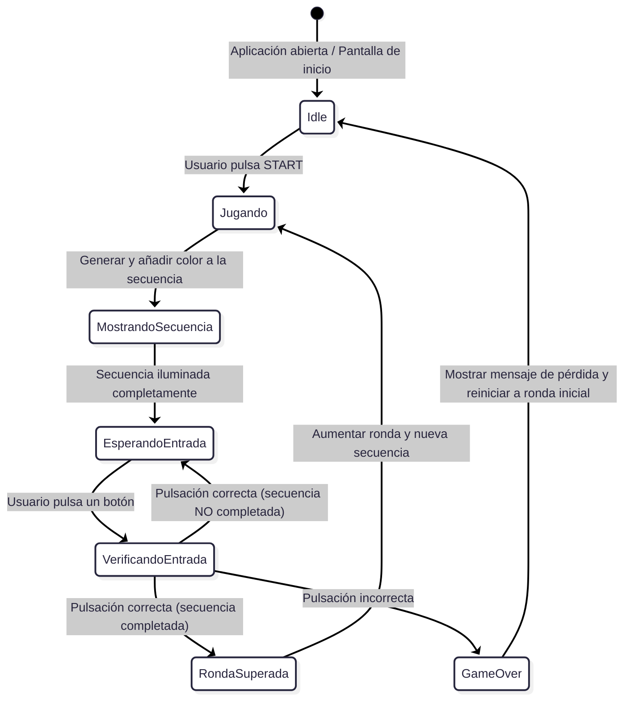

# SIMÓN DICE - PMDM 🦑🫧🪼

> **DIAGRAMA DE ESTADO 🎀**

```mermaid
---
config:
  theme: redux
  look: neo
---
stateDiagram-v2
  [*] --> Idle : Aplicación abierta / Pantalla de inicio
  Idle --> Jugando : Usuario pulsa START
  Jugando --> MostrandoSecuencia : Generar y añadir color a la secuencia
  MostrandoSecuencia --> EsperandoEntrada : Secuencia iluminada completamente
  EsperandoEntrada --> VerificandoEntrada : Usuario pulsa un botón
  VerificandoEntrada --> EsperandoEntrada : Pulsación correcta (secuencia NO completada)
  VerificandoEntrada --> RondaSuperada : Pulsación correcta (secuencia completada)
  VerificandoEntrada --> GameOver : Pulsación incorrecta
  RondaSuperada --> Jugando : Aumentar ronda y nueva secuencia
  GameOver --> Idle : Mostrar mensaje de pérdida y reiniciar a ronda inicial

```

