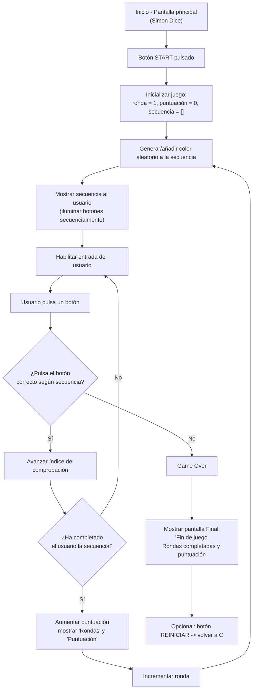

# SIMÓN DICE - PMDM 🦑🫧🪼

- **Antes de empezar a codificar el programa hemos realizado un diagrama de flujo y de estado para comprender de manera profunda la lógica...**

---

> **DIAGRAMA DE ESTADO 🎀**

---

> **DIAGRAMA DE FLUJO 🎳**

